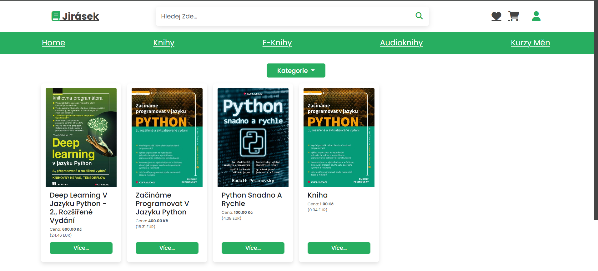
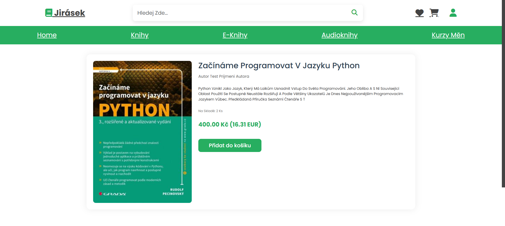
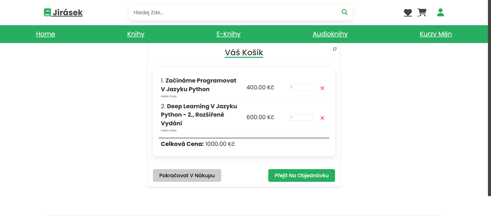

# 📚 Jirásek - internetové knihkupectví

Tato webová aplikace nabízí jednoduché rozhraní, filtrování, vyhledávání, plně funkční nákupní košík 
a vytváření objednávek 


![Ukázka aplikace] (static/screenshots/........)

## 🚀 Funkce
- registrace, přihlášení
- Prohlížení katalogu knih s možností filtrovat podle názvu knihy
- přidávání knih do oblíbených ( pro přihlášeného uživatele)
- přidávání knih do nákupního košíku a vytváření objednávek pro přihlášené i nepřihlášené uživatele
- Sekce pro zaměstrnance pro správu khih


## 🛠️ Instalace
1. naklonuj repositář
```bash
https://github.com/PetrTomsik/Online_store.git
cd Online_store
```


2. Vytvoř a aktivuj virtuální prostředí

3. nainstaluj závislosti
```bash
pip install -r requirements.txt
```

4. Nastav databázi 
```bash
python manage.py makemigrations
python manage.py migrate
```
5. spusť vývojový server
```bash
python manage.py runserver
```

## 🔧 Technologie
- Django (backend, templates)
- SQL Lite
- JavaScript
- CSS
- Git (.gitignore)

##  🧪 Testování 
```bash
python manage.py test
```

## Vytvořili
Lenka Marešová, Petr Tomšík, Petr Markvart

### další ukázky 





